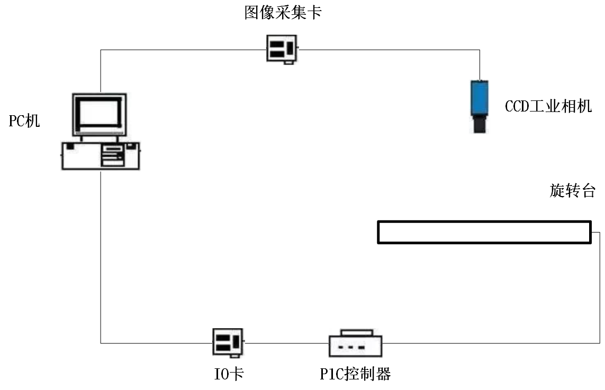
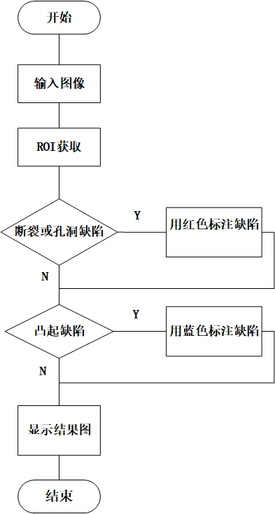
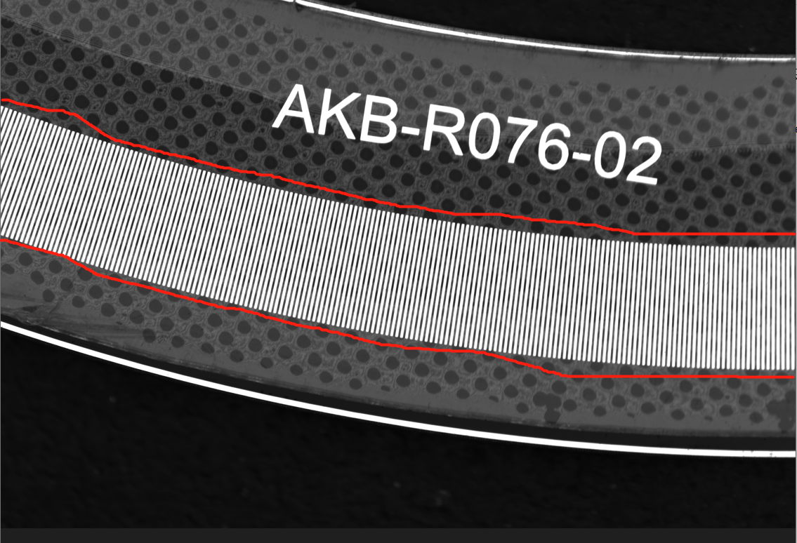
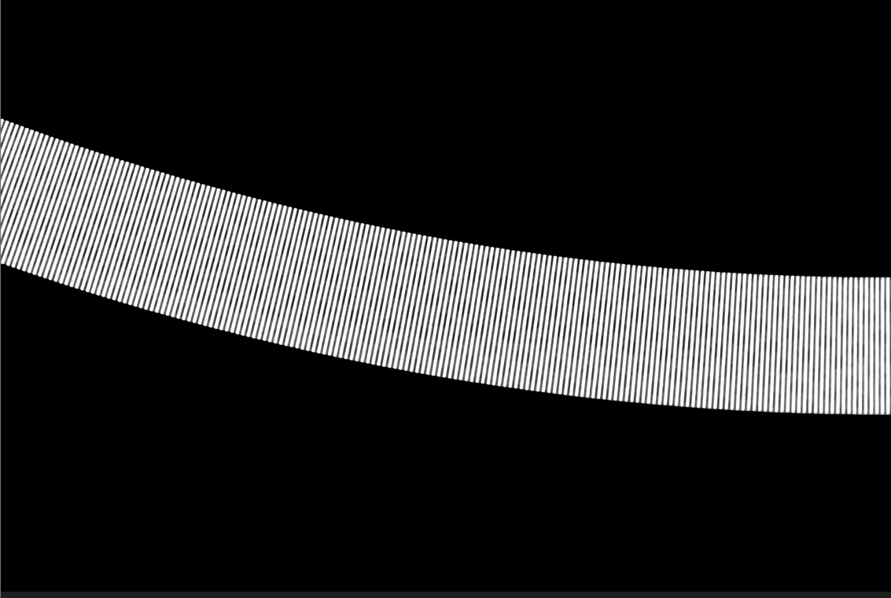
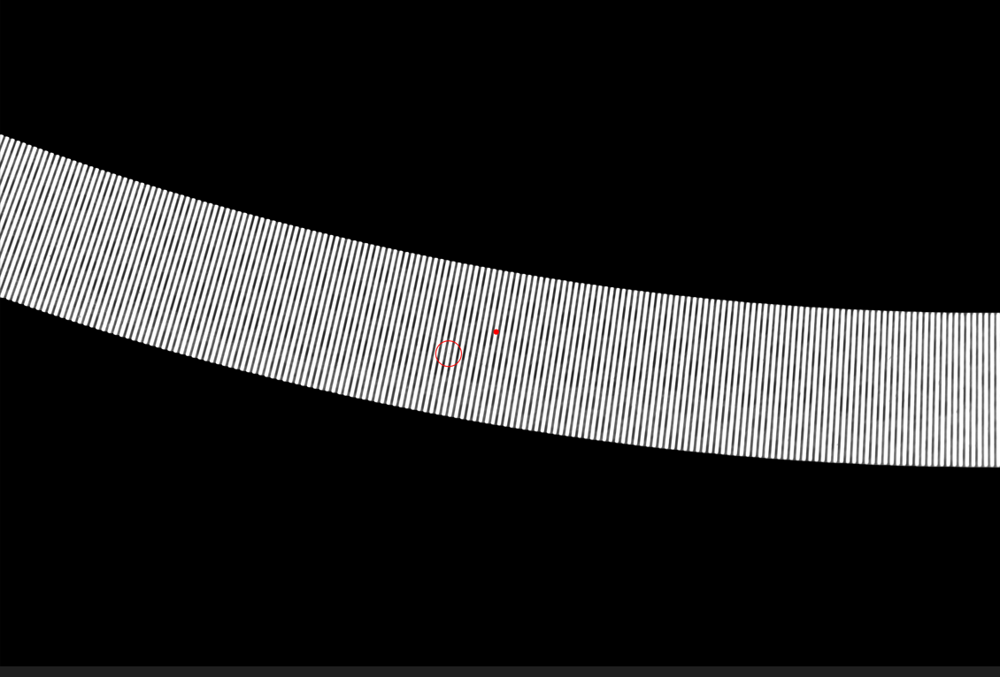

# 基于机器视觉的旋转编码器缺陷检测

# 1 背景及意义

旋转编码器是用来测量转速并配合PWM技术可以实现快速调速的装置，基本上每一个伺服电机都有一个旋转编码器。旋转编码器的质量将直接影响到伺服电机的好坏，所以每一个旋转编码器出厂前都要经过严格的质检。

传统的检测方法是依赖于人工进行的。由于人工缺陷检测存在**劳动强度过高、工作效率低、检测准确性不高、过于依赖个人经验、容易受主观因素**影响等缺点，使得基于机器视觉的自动缺陷检测替代传统的人工检测已经成为重要的趋势。与传统的人工检测相比，基于机器视觉的缺陷自动检测具有以下优点：**①速度快，检测范围更广，检测效率高；②精确度高，检测结果更加客观可靠；③能够实时工作**。

为解决此问题，笔者设计一种基于机器视觉的旋转编码器缺陷检测软件。目前该项目已落地，软件在工厂中使用良好。

# 2 系统框架

## 2.1 硬件框架

下图是本软件硬件框架图，整个框架由**PC机，图像采集卡、CCD工业相机、IO卡、PLC控制器和旋转台**六部分组成。系统工作过程如下。

首先，将编码器放置在旋转台上，然后启动系统，PLC控制器会控制旋转台以一定角度缓慢旋转，直至转完一圈。在旋转过程中，CCD相机会实时采集图片送到PC机中进行缺陷检测，若有缺陷，则旋转台停转，等待PC机下一步指令

## 2.2 软件框架

整个缺陷识别过程见下图。首先要获取图片的感兴趣区域（ROI），然后在ROI区域上先进行断裂或孔洞缺陷检测，若有此类缺陷，则先用红色标注该类缺陷，然后再进行凸起缺陷检测，若没有，则直接进行凸起缺陷检测。同理，若有凸起缺陷，则先用蓝色标注该缺陷，然后再显示结果图，若没有该类缺陷，则直接显示结果图

# 3 检测原理

## 3.1 获取roi原理

编码器型号多种多样，如何**自适应获取**不同编码器的感兴趣区域？如下图示，这是某种型号的编码器图片，ROI区域是红色线条包围的区域。笔者设计了一种基于形态学的分割算法，可以准确地提取到编码器图像的ROI。大概步骤如下：
1.输入图像。2.原图转灰度图。3.otsu算法获得最佳阈值t。4.灰度图二值化。5.对二值图使用闭操作，其中核函数大小为(50,50),形状使用默认的。6.findContours函数找闭操作后的图像轮廓。7.筛选出面积最大的轮廓作为模板mask。8。将原图的灰度图与mask进行与操作，得到roi。

分割结果见下图

## 3.2 缺陷检测原理

编码器有多种缺陷，如何检测这些缺陷？将缺陷分为两大类：断裂(孔洞)以及镂空，对每一种缺陷设计不同的算法

对于断裂(孔洞)缺陷，可以使用轮廓面积作为准则来判断；而镂空缺陷，使用两次闭操作进行检测。具体为，首先对二值图进行第一次闭操作，核大小为(30,30),这个操作将会**定位到缺口**的位置，除了缺口，其他地方将会变白；然后再对二值图做第二次闭操作，核大小核大小为(50,50)，这次操作是为了得到**与操作的mask**。然后再将第一次闭操作得到的图像**反二值化**，这样缺口就变成了白色。最后将**mask与反二值化好的图片与操作**，得到缺口图像。

